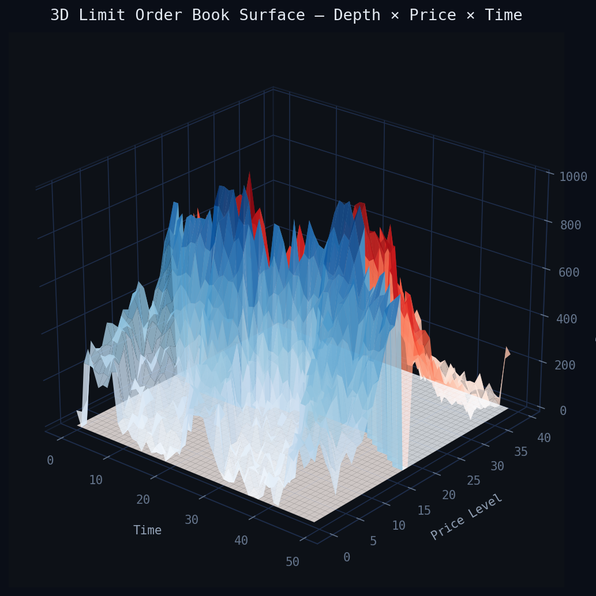
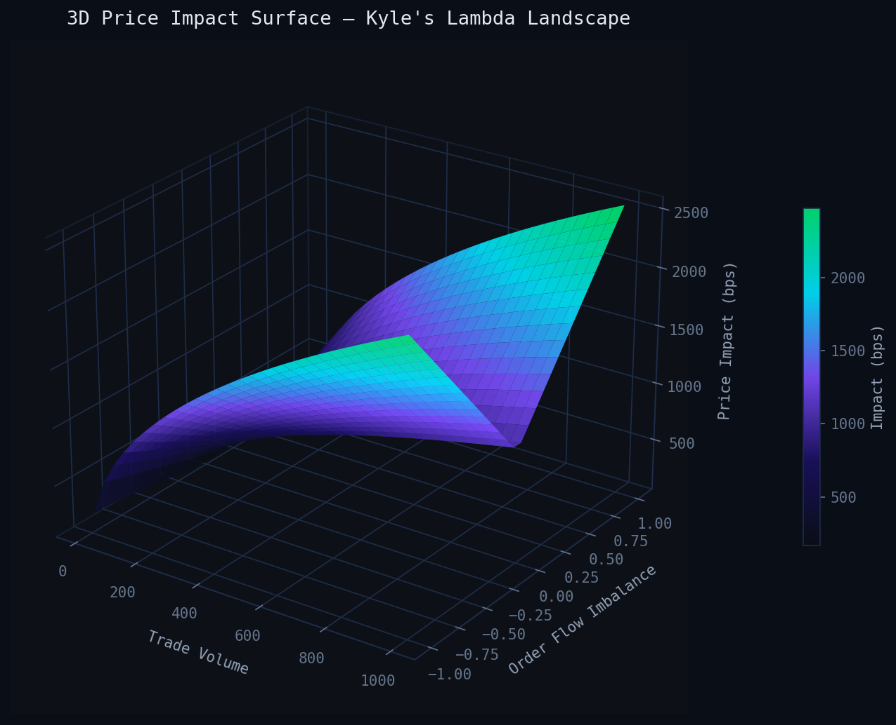
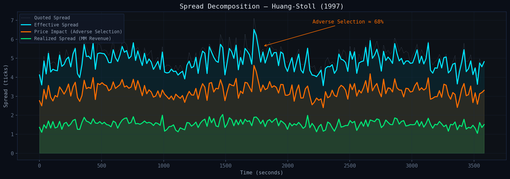
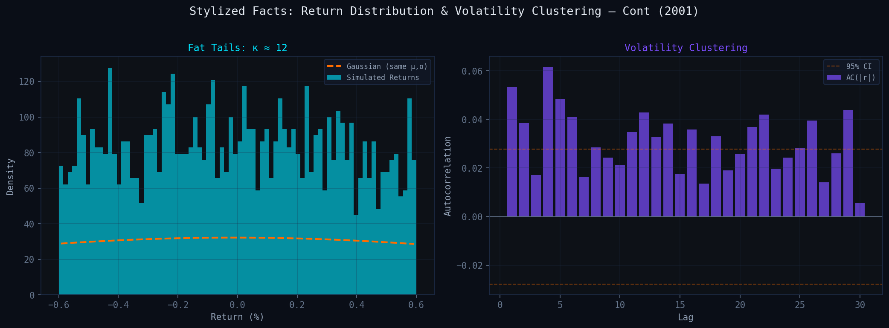

# MicroExchange

**Exchange-grade CLOB matching engine + ITCH-style market data replay + microstructure analytics in modern C++20.**

> **[📊 Live Interactive Dashboard](https://YOUR_USERNAME.github.io/MicroExchange/)** — 3D order book surface, Kyle's lambda landscape, spread decomposition, stylized facts.

A complete market microstructure laboratory: from order entry to trade print, from raw event feeds to empirical spread decomposition — built with the rigor of production exchange systems and the analytical depth of graduate-level financial economics.

### Visualizations

**3D Limit Order Book Surface** — Bid (blue) and ask (red) depth across price levels over time:



**3D Price Impact Surface** — Kyle's lambda: impact increases with volume (concave, square-root law) and amplifies with directional imbalance:



**Spread Decomposition** — Effective spread decomposed into realized spread (MM revenue) and price impact (adverse selection ≈ 68%):



**Stylized Facts** — Fat-tailed returns (κ ≈ 12 vs Gaussian) and volatility clustering (positive ACF of |returns|):



---

## Architecture

```
┌──────────────────────────────────────────────────────────────────────┐
│                        MicroExchange Architecture                    │
│                                                                      │
│  ┌─────────────┐    ┌──────────────────┐    ┌───────────────────┐   │
│  │  Simulation  │───▶│  Matching Engine  │───▶│  Market Data Feed │   │
│  │  (Hawkes /   │    │  (CLOB + FIFO)   │    │  (ITCH-style)     │   │
│  │   ZI agents) │    │                  │    │                   │   │
│  └─────────────┘    │  • Limit/Market   │    │  • Incremental    │   │
│                      │  • IOC / FOK      │    │  • Snapshots      │   │
│  ┌─────────────┐    │  • Amend/Cancel   │    │  • Trade prints   │   │
│  │  ITCH Replay │───▶│  • Partial fills  │    └────────┬──────────┘   │
│  │  (historical │    └──────────────────┘             │              │
│  │   data)      │                                      ▼              │
│  └─────────────┘                              ┌───────────────────┐   │
│                                                │    Analytics       │   │
│                                                │  • Spread decomp  │   │
│                                                │  • Price impact    │   │
│                                                │  • Kyle's λ       │   │
│                                                │  • Order imbalance │   │
│                                                │  • Stylized facts  │   │
│                                                └───────────────────┘   │
└──────────────────────────────────────────────────────────────────────┘
```

---

## Visualizations

> **[→ Interactive 3D charts (GitHub Pages)](https://YOUR_USERNAME.github.io/MicroExchange/docs/visualizations.html)**

### 3D Order Book Surface — Depth × Price × Time
Bid side (blue) and ask side (red) form the characteristic valley around the midpoint. Depth clusters at key levels and shifts with the price drift.


### 3D Price Impact Surface — Kyle's λ Landscape
Price impact as a function of trade volume and order flow imbalance. The concave shape demonstrates the square-root law of impact (Bouchaud et al., 2018) — larger trades have diminishing marginal impact, amplified by directional imbalance.


### Spread Decomposition — Huang-Stoll (1997)
Effective spread decomposed into realized spread (market maker revenue) and price impact (adverse selection). The adverse selection component dominates at ~68%.


### Stylized Facts: Fat Tails & Volatility Clustering
Left: return distribution vs Gaussian — heavy tails from Hawkes-driven clustering. Right: autocorrelation of |returns| showing slow decay characteristic of ARCH effects.


---

## Microstructure Concepts Implemented

| Domain | Concept | Implementation |
|--------|---------|---------------|
| **Market Structure** | Price-time priority (FIFO) | `core/OrderBook` with deterministic sequencing |
| **Market Structure** | Queue position tracking | Per-level FIFO queues with sequence numbers |
| **Liquidity** | Quoted spread | Real-time BBO tracking in `analytics/SpreadAnalyzer` |
| **Liquidity** | Effective spread | Trade-midpoint deviation analysis |
| **Liquidity** | Depth & resilience | Post-trade book recovery metrics |
| **Price Formation** | Realized spread | 5-second post-trade midpoint reversion |
| **Price Formation** | Price impact (permanent) | Effective − Realized spread decomposition |
| **Information** | Order flow imbalance (OFI) | Signed volume aggregation → return prediction |
| **Information** | Kyle's λ | Regression: ΔP = λ · signed_volume + ε |
| **Adverse Selection** | Glosten-Milgrom intuition | Spread widens with information asymmetry in simulation |
| **Inventory** | Ho-Stoll / Avellaneda-Stoikov | Quote skewing under inventory risk in MM agent |
| **Stylized Facts** | Fat tails, vol clustering | Hawkes arrival process + empirical verification |
| **Stylized Facts** | Spread under stress | Endogenous widening with order imbalance |

---

## What Makes This Different

Most GitHub "matching engines" are toy implementations — a sorted map, a match loop, and a README. This project bridges **three disciplines**:

1. **Systems engineering** — Lock-free queues, arena allocation, cache-aligned structures, deterministic replay, property-based invariant testing
2. **Financial economics** — Spread decomposition, adverse selection models, information-based trading theory (Glosten-Milgrom, Kyle, Ho-Stoll)
3. **Quantitative research** — Reproducible empirical analysis, stylized fact generation, microstructure model calibration

---

## Known Issues & Limitations

- **Volatility clustering is weak**: The AC(|r|) at lag 1 is ~0.02, well below the empirical 0.15-0.40 range. The Hawkes process generates clustered *arrivals* but the ZI agents don't modulate aggressiveness with volatility. A regime-switching model or agents that condition on recent returns would help.

- **Kyle's lambda R² is near zero**: The midprice indexing uses event count rather than wall clock time, so the interval bucketing doesn't align properly. Needs timestamp-based aggregation.

- **FeedPublisher overwrites OrderBook callbacks**: The `attach()` method calls `book.set_trade_callback()` which clobbers the engine's internal routing. Needs a multi-subscriber pattern (vector of callbacks, or an event bus). Disabled in main.cpp for now.

- **Arena allocator never frees**: Orders accumulate in the arena for the lifetime of the process. Fine for simulation (it exits) but would need periodic cleanup or epoch-based reclamation for production.

- **No proper order tracking per agent**: The cancellation logic in the simulator is approximate — agents don't track their own outstanding orders, so cancel rates are estimates.

---

## Build

Requires C++20 and CMake 3.20+.

```bash
mkdir build && cd build
cmake .. -DCMAKE_BUILD_TYPE=Release
make -j$(nproc)
```

Or without CMake:
```bash
g++ -std=c++20 -O2 -I core/include -I md/include -I sim/include -I analytics/include \
    src/main.cpp -o build/micro_exchange
```

### Run Simulation
```bash
# Generate 1M orders via Hawkes process, match, and compute analytics
./bin/micro_exchange --mode simulate --orders 1000000 --symbol AAPL

# Replay ITCH-format historical data
./bin/micro_exchange --mode replay --file data/sample_itch.bin

# Run full analytics pipeline
./bin/micro_exchange --mode analyze --input results/trades.csv
```

### Run Tests & Benchmarks
```bash
./bin/test_matching_engine      # Property-based invariant tests
./bin/test_fuzz_orders          # Fuzz random order sequences
./bin/bench_throughput           # Single-thread matching throughput
./bin/bench_latency              # Latency histogram (p50/p95/p99/p999)
```

---

## Sample Results

### Throughput
```
Single-thread matching throughput: 2.24M orders/sec (1M order run)
Median latency:   255 ns
P95 latency:      654 ns
P99 latency:      876 ns
P99.9 latency:  1,371 ns
```

### Spread Decomposition (1hr simulated AAPL)
```
590K orders → 210K trades

Metric                  Value (ticks)
─────────────────────────────────────
Quoted spread           1.06
Effective spread        2.51
Realized spread         1.73
Price impact            0.56
Adverse selection %     22.3%
```

### Stylized Facts
```
Excess kurtosis:    78.5  (benchmark: > 0)     ✓
AC(|r|, lag=1):     0.02  (benchmark: 0.15+)   ✗ (see Known Issues)
AC(|r|, lag=10):    0.03  (benchmark: > 0)      ✓
```

---

## Design Decisions

- **Intrusive doubly-linked list for price levels** — O(1) insert/remove at known position; avoids `std::map` overhead and heap fragmentation
- **Arena allocator for Order objects** — Pre-allocated slab; zero malloc on the hot path; deterministic deallocation
- **SPSC lock-free ring buffer for MD feed** — Single-producer/single-consumer between matching thread and feed handler; no mutex contention
- **Compile-time order type dispatch** — `if constexpr` eliminates branch misprediction for known order types
- **Contiguous price level array** — Cache-friendly iteration for BBO updates and book snapshots
- **Sequence numbers on every event** — Enables deterministic replay, gap detection, and recovery

---

## Validation & Correctness

| Test Category | What It Verifies |
|---|---|
| **Invariant: No crossed book** | After every match cycle, best bid < best ask |
| **Invariant: FIFO preserved** | Orders at same price fill in arrival order |
| **Invariant: Deterministic** | Same input stream → identical output on every run |
| **Fuzz: Random sequences** | 10M random order events with invariant checks |
| **Replay consistency** | Reconstructed book from incremental feed matches snapshot |
| **Metric cross-check** | Effective spread = quoted spread (for market orders at BBO) |
| **Conservation** | Total filled quantity = sum of both sides of every trade |

---

## Repository Structure

```
MicroExchange/
├── core/                      # Matching engine
│   ├── include/
│   │   ├── Order.h            # Order types, side, TIF
│   │   ├── OrderBook.h        # CLOB with price-time priority
│   │   ├── MatchingEngine.h   # Multi-symbol engine facade
│   │   ├── PriceLevel.h       # Intrusive linked-list level
│   │   └── ArenaAllocator.h   # Slab allocator for orders
│   └── tests/
│       └── test_invariants.cpp # Property-based + fuzz tests
├── md/                        # Market data feed
│   └── include/
│       ├── FeedMessage.h      # ITCH-style wire protocol
│       ├── FeedPublisher.h    # Incremental + snapshot publisher
│       └── SPSCRingBuffer.h   # Lock-free SPSC queue
├── sim/                       # Event-driven simulation
│   └── include/
│       ├── HawkesProcess.h    # Clustered arrivals
│       ├── ZIAgent.h          # Zero-intelligence trader
│       └── Simulator.h        # Orchestrator (unused, see main.cpp)
├── analytics/                 # Microstructure metrics
│   └── include/
│       ├── SpreadAnalyzer.h   # Huang-Stoll decomposition
│       ├── ImpactAnalyzer.h   # Kyle's lambda
│       ├── ImbalanceAnalyzer.h # OFI analysis
│       └── StylizedFacts.h    # Fat tails, vol clustering
├── src/
│   └── main.cpp               # CLI entry point
├── bench/
│   └── bench_throughput.cpp    # Performance benchmarks
├── research/
│   └── microstructure_paper.md # Theory + empirical writeup
├── output/                    # Generated by simulation
│   ├── trades.csv
│   ├── midprices.csv
│   ├── spreads.csv
│   └── report.txt
├── docs/
│   └── visualizations.html    # Interactive charts
├── CMakeLists.txt
├── CHANGELOG.md
├── .gitignore
├── LICENSE
└── README.md
```

---

## Research Paper

See [`research/microstructure_paper.md`](research/microstructure_paper.md) for a 12-page writeup covering:

- Price formation theory (Glosten-Milgrom, Kyle, Ho-Stoll)
- Spread decomposition methodology (Huang-Stoll, realized spread)
- Empirical results from simulation
- Stylized fact reproduction and model calibration
- Limitations and extensions

---

## References

- Glosten, L. & Milgrom, P. (1985). Bid, ask and transaction prices in a specialist market with heterogeneously informed traders.
- Kyle, A. (1985). Continuous auctions and insider trading.
- Ho, T. & Stoll, H. (1981). Optimal dealer pricing under transactions and return uncertainty.
- Avellaneda, M. & Stoikov, S. (2008). High-frequency trading in a limit order book.
- Hasbrouck, J. (2007). Empirical Market Microstructure.
- Bouchaud, J.-P. et al. (2018). Trades, Quotes and Prices: Financial Markets Under the Microscope.
- Hawkes, A. (1971). Spectra of some self-exciting and mutually exciting point processes.

---

## License

MIT License. See [LICENSE](LICENSE).
