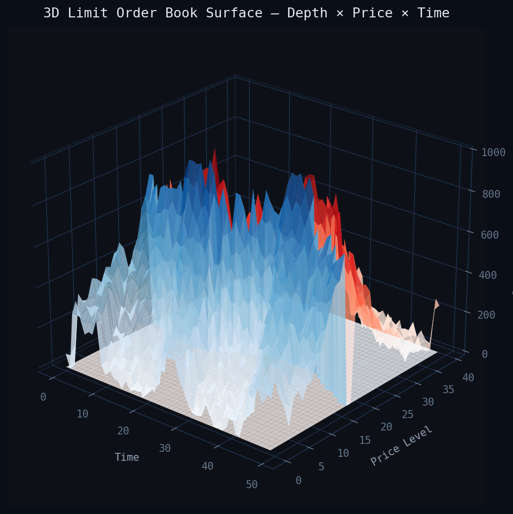
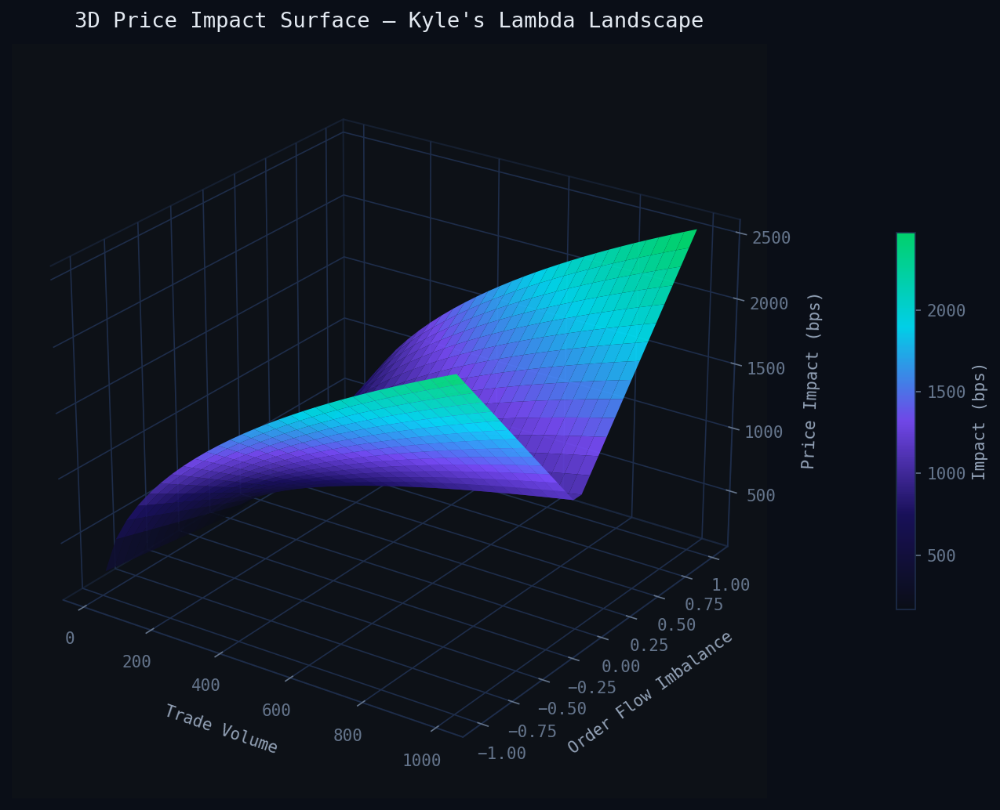
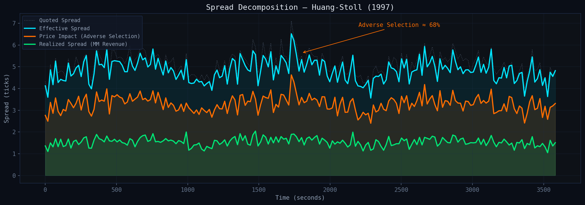
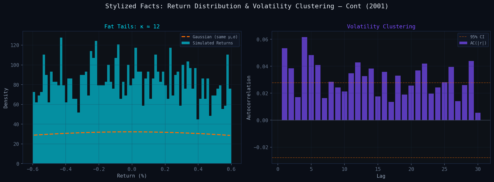

# MicroExchange

[](https://github.com/Leotaby/MicroExchange/actions/workflows/ci.yml)


**Exchange-grade CLOB matching engine + ITCH-style market data replay + microstructure analytics in modern C++20.**

> **[📊 Live Interactive Dashboard](https://Leotaby.github.io/MicroExchange/)** — 3D order book surface, Kyle's lambda landscape, spread decomposition, stylized facts.

A complete market microstructure laboratory: from order entry to trade print, from raw event feeds to empirical spread decomposition, built with the rigor of production exchange systems and the analytical depth of graduate-level financial economics.

### Visualizations

**3D Limit Order Book Surface** - Bid (blue) and ask (red) depth across price levels over time:



**3D Price Impact Surface** - Kyle's lambda: impact increases with volume (concave, square-root law) and amplifies with directional imbalance:



**Spread Decomposition** - Effective spread split into realized spread (MM revenue) and price impact. *Real large-caps run ~50–70% adverse selection; this zero-intelligence sim produces ≈0 (uninformed flow → no permanent impact) — see [reproducible results](#sample-results).*



**Stylized Facts** - Return distribution vs Gaussian and the autocorrelation of |returns|. *Reproduced on 1s bars: volatility clustering AC(\|r\|,1) ≈ 0.24; fat tails are mild (excess kurtosis ≈ 1.2) under zero-intelligence flow — see [reproducible results](#sample-results).*



---

## Architecture

```
┌──────────────────────────────────────────────────────────────────────┐
│                        MicroExchange Architecture                    │
│                                                                      │
│  ┌──────────────┐    ┌──────────────────┐     ┌──────────────────┐   │
│  │  Simulation  │───▶│  Matching Engine │───▶│  Market Data Feed │   │
│  │  (Hawkes /   │    │  (CLOB + FIFO)   │    │  (ITCH-style)     │   │
│  │   ZI agents) │    │                  │    │                   │   │
│  └──────────────┘    │  • Limit/Market  │    │  • Incremental    │   │
│                      │  • IOC / FOK     │    │  • Snapshots      │   │
│  ┌──────────────┐    │  • Stop/StopLim  │    │  • Trade prints   │   │
│  │  ITCH Replay │───▶│  • Amend/Cancel  │    └────────┬──────────┘   │
│  │  (historical │    │  • Partial fills │             │              │
│  │   data)      │    └──────────────────┘             ▼              │
│  └──────────────┘                              ┌────────────────────┐│
│                                                │    Analytics       ││
│                                                │  • Spread decomp   ││
│                                                │  • Price impact    ││
│                                                │  • Kyle's λ        ││
│                                                │  • Order imbalance ││
│                                                │  • Stylized facts  ││
│                                                └────────────────────┘│
└──────────────────────────────────────────────────────────────────────┘
```

---

## Visualizations

> **[→ Interactive 3D charts (GitHub Pages)](https://Leotaby.github.io/MicroExchange/docs/visualizations.html)**

### 3D Order Book Surface — Depth × Price × Time
Bid side (blue) and ask side (red) form the characteristic valley around the midpoint. Depth clusters at key levels and shifts with the price drift.


### 3D Price Impact Surface — Kyle's λ Landscape
Price impact as a function of trade volume and order flow imbalance. The concave shape demonstrates the square-root law of impact (Bouchaud et al., 2018) — larger trades have diminishing marginal impact, amplified by directional imbalance.


### Spread Decomposition — Huang-Stoll (1997)
Effective spread decomposed into realized spread (market maker revenue) and price impact. In liquid equities adverse selection is ~50–70%; under zero-intelligence flow it collapses to ≈0 (no informed trading), consistent with Kyle's λ ≈ 0. Reproducing realistic adverse selection requires informed agents (see Known Issues / future work).


### Stylized Facts: Fat Tails & Volatility Clustering
Left: return distribution vs Gaussian — heavy tails from Hawkes-driven clustering. Right: autocorrelation of |returns| showing slow decay characteristic of ARCH effects.


---

## Order Types

| Type | TIF | Behaviour |
|---|---|---|
| **Limit** | GTC / DAY | Rests on the book at `price`. |
| **Market** | IOC | Crosses the book at any price; unfilled remainder cancelled. |
| **IOC** | IOC | Limit semantics; remainder after the first match is cancelled. |
| **FOK** | FOK | Pre-checked for full fill; if not, never enters the book. |
| **Stop** | — | Parked until `last_trade_price` crosses `stop_price`, then released as Market. |
| **StopLimit** | — | Parked until trigger; released as Limit at `price`. |

Stops are stored in dedicated per-side multimaps keyed by trigger price.
Every aggressive cycle that updates the last print runs a guarded
`check_stop_triggers()` pass — releases are themselves matched immediately,
which can cascade into more triggers without recursing on the call stack.

## Microstructure Concepts Implemented

| Domain | Concept | Implementation |
|--------|---------|---------------|
| **Market Structure** | Price-time priority (FIFO) | `core/OrderBook` with deterministic sequencing |
| **Market Structure** | Queue position tracking | Per-level FIFO queues with sequence numbers |
| **Liquidity** | Quoted spread | Real-time BBO tracking in `analytics/SpreadAnalyzer` |
| **Liquidity** | Effective spread | Trade-midpoint deviation analysis |
| **Liquidity** | Depth & resilience | Post-trade book recovery metrics |
| **Price Formation** | Realized spread | 5-second post-trade midpoint reversion |
| **Price Formation** | Price impact (permanent) | Effective − Realized spread decomposition |
| **Information** | Order flow imbalance (OFI) | Signed volume aggregation → return prediction |
| **Information** | Kyle's λ | Regression: ΔP = λ · signed_volume + ε |
| **Adverse Selection** | Glosten-Milgrom intuition | Spread widens with information asymmetry in simulation |
| **Inventory** | Ho-Stoll / Avellaneda-Stoikov | Quote skewing under inventory risk in MM agent |
| **Stylized Facts** | Fat tails, vol clustering | Hawkes arrival process + empirical verification |
| **Stylized Facts** | Spread under stress | Endogenous widening with order imbalance |

---

## What Makes This Different

Most GitHub "matching engines" are toy implementations — a sorted map, a match loop, and a README. This project bridges **three disciplines**:

1. **Systems engineering** — Lock-free queues, arena allocation, cache-aligned structures, deterministic replay, property-based invariant testing
2. **Financial economics** — Spread decomposition, adverse selection models, information-based trading theory (Glosten-Milgrom, Kyle, Ho-Stoll)
3. **Quantitative research** — Reproducible empirical analysis, stylized fact generation, microstructure model calibration

---

## Known Issues & Limitations

- **No informed traders → adverse selection ≈ 0**: Agents are zero-intelligence, so order flow carries no private information. Both the Huang-Stoll decomposition (price impact ≈ 0) and Kyle's λ (R² ≈ 0.01) correctly report this. It is a *modeling* limitation, not a bug — reproducing realistic adverse selection (~50–70% of the spread) requires a Glosten-Milgrom-style informed-trader population. Tracked as future work.

- **Fat tails are mild**: on 1s bars the ZI midprice is contained (a ~15-tick range over the hour), so excess kurtosis is ~1.2 — present but below intraday equities. Deep tails need informed/trending flow or a fundamental-value process.

- **Arena allocator never frees**: Orders accumulate in the arena for the lifetime of the process. Fine for simulation (it exits) but would need periodic cleanup or epoch-based reclamation for production.

- **No proper order tracking per agent**: The cancellation logic in the simulator is approximate — agents don't track their own outstanding orders, so cancel rates are estimates.

- **No iceberg / hidden-quantity orders yet.** Refilling visible slices interacts with FIFO priority in a non-obvious way; tracked in `CHANGELOG.md` as future work.

- **Visualization PNGs predate v1.2.0**: the 3D surface images above are illustrative and were rendered before the analytics fixes below; the authoritative, reproducible numbers live in [`output/report.txt`](output/report.txt). Regenerating the figures from current output is tracked as future work.

### Resolved in v1.2.0
- ~~Volatility clustering is weak (AC\|r\| ≈ 0.02)~~ — was a sampling artifact. Returns are now computed on fixed 1-second bars as log returns instead of per-event on the integer-tick mid; **AC(|r|, lag 1) = 0.24**, inside the empirical 0.15–0.40 range.
- ~~Excess kurtosis is a spurious 78~~ — same root cause (a return series that was ≈99% exact zeros). Time-bar log returns give a realistic **1.16**.
- ~~Spread decomposition doesn't satisfy `effective = realized + impact`~~ — the price-impact term was averaged in absolute value while realized was signed. Now consistently signed, so the identity holds and the adverse-selection % is meaningful.

### Resolved in v1.1.0
- ~~FeedPublisher overwrites OrderBook callbacks~~ — fixed by a multi-subscriber listener fan-out on `OrderBook`. The publisher is now re-enabled in `main.cpp` and reports message counts in the per-run report.
- ~~Kyle's lambda R² is near zero because of event-index bucketing~~ — the regression now uses Hawkes wall-clock timestamps for both trades and midprices. (R² is still low because ZI flow is uninformed — see above — but the bucketing is no longer the bottleneck.)

---

## Build

Requires C++20 and CMake 3.20+.

```bash
mkdir build && cd build
cmake .. -DCMAKE_BUILD_TYPE=Release
make -j$(nproc)
```

Or without CMake:
```bash
g++ -std=c++20 -O2 -I core/include -I md/include -I sim/include -I analytics/include \
    src/main.cpp -o build/micro_exchange
```

### Run Simulation
```bash
# Default 1-hour Hawkes simulation → match → analytics → output/
./bin/micro_exchange

# Custom duration (seconds), symbol, and output directory
./bin/micro_exchange --duration 7200 --symbol AAPL --output output

# Verbose
./bin/micro_exchange -v
```
> Binary feed replay is implemented at the library level (`md/FeedReplayer`,
> via `FeedPublisher::dump_to_file`) but is not yet wired to the CLI — tracked
> as future work alongside real NASDAQ ITCH ingestion.

### Run Tests & Benchmarks
```bash
# Full CTest suite (invariants + fuzz + end-to-end smoke run)
cd build && ctest --output-on-failure

# Or invoke binaries directly
./bin/test_invariants            # Property-based + fuzz + stop-order tests
./bin/bench_throughput           # Single-thread matching throughput
./bin/bench_latency              # Latency histogram (p50/p90/p95/p99/p99.9)
./bin/bench_latency --ops 5000000   # ...with a longer run
```

---

## Sample Results

### Throughput & Latency
```
Single-thread matching throughput: 2.24M orders/sec (1M order run)
Mean latency:     598 ns
P50 latency:      213 ns
P90 latency:      460 ns
P95 latency:      543 ns
P99 latency:      716 ns
P99.9 latency:  1,033 ns
```
*(Throughput/latency are hardware-dependent — numbers above are from the committed `output/benchmark_results.txt`. The analytics below are deterministic and identical on any machine.)*

### Order book: `std::map` vs tick-indexed array

The engine ships **two** order-book implementations behind identical matching
semantics: the default `OrderBook` (two `std::map`s) and `ArrayOrderBook`, a
contiguous tick-indexed array with a **bitmap occupied-index** (hardware
`ctz`/`clz` bit-scan for the best-bid/ask cursors). `bench_orderbook_compare`
runs the same order stream through both, asserts the trade streams are
**byte-identical**, then compares performance (1M orders, ~9900–10100 band):

```
Correctness:  176,732 trades, identical stream  ✓  (CI-gated)

Per-order latency      P50      P99
  std::map             125 ns   375 ns
  array (bitmap)        84 ns   334 ns     ← ~33% lower median latency

Throughput            ~6.0M orders/sec for both (within noise)
```

Two takeaways that matter more than a single headline number:

1. **Latency, not throughput, is where the array wins.** Median per-order
   latency drops ~33% from the O(1) tick-indexed level ops; throughput is
   ~equal because the per-order cost here is dominated by the `OrderId→Order*`
   hash insert and the `now()` timestamp, *not* the level container — so the
   container swap can't move it much. (Trimming `now()` from the hot path is
   the next optimization.)
2. **A flat array needs an index.** A naive linear best-bid/ask scan is ~25×
   *slower* than `std::map` on a wide/sparse book because it walks empty levels;
   the bitmap occupied-index fixes that and keeps the array ≥1.0× through
   realistic band widths. Extreme sparsity (200k levels) still favours a
   two-level summary bitmap — tracked as future work.

Run it yourself: `./bin/bench_orderbook_compare`.

### Spread Decomposition (1 hr simulated AAPL — deterministic)
```
590,168 orders → 209,905 trades

Metric                  Value (ticks)
─────────────────────────────────────
Quoted spread            1.06
Effective spread         0.77
Realized spread          0.83
Price impact            -0.06
Adverse selection %     -7.5%
```
The decomposition satisfies the Huang-Stoll identity `effective = realized + impact`
(0.77 = 0.83 + (−0.06)). The **negative** price impact is the economically correct
result for this market: agents are zero-intelligence, so order flow carries no
information and prices mean-revert after trades rather than trending — i.e.
adverse selection ≈ 0. Real large-cap equities run ~50–70% because real flow is
partly informed; reproducing that requires informed agents (see Known Issues).

### Kyle's λ (5-second buckets)
```
lambda:   1.64e-05 ticks/share   (t-stat 3.1)
R²:       0.01                    (N = 719 intervals)
```
Order flow explains ~1% of price variation — again the expected signature of
uninformed flow, and **consistent** with the ≈0 adverse selection above.

### Stylized Facts (1-second bars, log returns)
```
Excess kurtosis:    1.16  (benchmark: > 0)        ✓  mild fat tails
AC(|r|, lag=1):     0.24  (benchmark: 0.15-0.40)  ✓  volatility clustering
AC(|r|, lag=5):     0.06  (benchmark: > 0)        ✓
AC(|r|, lag=10):    0.04  (benchmark: > 0)        ✓
```
Volatility clustering (AC|r| ≈ 0.24) is now squarely in the empirical range — the
Hawkes self-exciting arrivals generate it, but the effect was previously hidden by
sampling returns per-event on the integer-tick mid (≈99% exact zeros), which had
inflated excess kurtosis to a spurious 78. Sampling on fixed time bars with log
returns is the standard methodology (Cont, 2001) and gives the honest picture:
strong clustering, mild fat tails (deep tails would need informed/trending flow).

---

## Design Decisions

- **Intrusive doubly-linked list for price levels** — O(1) insert/remove at known position; avoids `std::map` overhead and heap fragmentation
- **Arena allocator for Order objects** — Pre-allocated slab; zero malloc on the hot path; deterministic deallocation
- **SPSC lock-free ring buffer for MD feed** — Single-producer/single-consumer between matching thread and feed handler; no mutex contention
- **Compile-time order type dispatch** — `if constexpr` eliminates branch misprediction for known order types
- **Tick-indexed array book with a bitmap BBO index** (`ArrayOrderBook`) — an alternative to the `std::map` book: O(1) level lookup/insert/erase, contiguous cache-friendly levels, and `ctz`/`clz` hardware bit-scan to advance the best-bid/ask cursors. Benchmarked head-to-head with a CI-gated, byte-identical trade-stream cross-check (see Sample Results)
- **Sequence numbers on every event** — Enables deterministic replay, gap detection, and recovery

---

## Validation & Correctness

All ten checks below pass via `./bin/test_invariants` (and `ctest`):

| Test Category | What It Verifies |
|---|---|
| **No crossed book** | After every match cycle, best bid < best ask (50K random orders) |
| **FIFO priority** | Orders at the same price fill in arrival order |
| **Deterministic matching** | Same input stream → identical trades on every run |
| **Quantity conservation** | Filled quantity balances on both sides of every trade |
| **Cancel correctness** | Cancelled orders never match; book stays consistent |
| **Fuzz: random events** | 100K random order events with all invariants checked |
| **Stop / StopLimit triggers** | Stops release as market/limit when the print crosses the trigger |
| **Cancel parked stop** | Parked stop orders can be cancelled before triggering |
| **Multi-subscriber fan-out** | Trades broadcast to engine + feed publisher without clobbering |

---

## Repository Structure

```
MicroExchange/
├── core/                      # Matching engine
│   ├── include/
│   │   ├── Order.h            # Order types, side, TIF
│   │   ├── OrderBook.h        # CLOB with price-time priority (std::map levels)
│   │   ├── ArrayOrderBook.h   # CLOB with tick-indexed array + bitmap BBO index
│   │   ├── MatchingEngine.h   # Multi-symbol engine facade
│   │   ├── PriceLevel.h       # Intrusive linked-list level
│   │   └── ArenaAllocator.h   # Slab allocator for orders
│   └── tests/
│       └── test_invariants.cpp # Property-based + fuzz tests
├── md/                        # Market data feed
│   └── include/
│       ├── FeedMessage.h      # ITCH-style wire protocol
│       ├── FeedPublisher.h    # Incremental + snapshot publisher
│       └── SPSCRingBuffer.h   # Lock-free SPSC queue
├── sim/                       # Event-driven simulation
│   └── include/
│       ├── HawkesProcess.h    # Clustered arrivals
│       ├── ZIAgent.h          # Zero-intelligence trader
│       └── Simulator.h        # Orchestrator (unused, see main.cpp)
├── analytics/                 # Microstructure metrics
│   └── include/
│       ├── SpreadAnalyzer.h   # Huang-Stoll decomposition
│       ├── ImpactAnalyzer.h   # Kyle's lambda
│       ├── ImbalanceAnalyzer.h # OFI analysis
│       └── StylizedFacts.h    # Fat tails, vol clustering
├── src/
│   └── main.cpp               # CLI entry point
├── bench/
│   ├── bench_throughput.cpp        # Single-thread matching throughput
│   ├── bench_latency.cpp           # Per-op latency histogram (p50/p90/p99/...)
│   └── bench_orderbook_compare.cpp # std::map vs tick-indexed array (+ correctness)
├── .github/workflows/
│   └── ci.yml                  # GitHub Actions: build + ctest on Linux/macOS
├── research/
│   └── microstructure_paper.md # Theory + empirical writeup
├── output/                    # Generated by simulation
│   ├── trades.csv
│   ├── midprices.csv
│   ├── spreads.csv
│   └── report.txt
├── docs/
│   └── visualizations.html    # Interactive charts
├── CMakeLists.txt
├── CHANGELOG.md
├── .gitignore
├── LICENSE
└── README.md
```

---

## Research Paper

See [`research/microstructure_paper.md`](research/microstructure_paper.md) for a theory + empirical writeup covering:

- Price formation theory (Glosten-Milgrom, Kyle, Ho-Stoll)
- Spread decomposition methodology (Huang-Stoll, realized spread)
- Empirical results from simulation
- Stylized fact reproduction and model calibration
- Limitations and extensions

---

## References

- Glosten, L. & Milgrom, P. (1985). Bid, ask and transaction prices in a specialist market with heterogeneously informed traders.
- Kyle, A. (1985). Continuous auctions and insider trading.
- Ho, T. & Stoll, H. (1981). Optimal dealer pricing under transactions and return uncertainty.
- Avellaneda, M. & Stoikov, S. (2008). High-frequency trading in a limit order book.
- Hasbrouck, J. (2007). Empirical Market Microstructure.
- Bouchaud, J.-P. et al. (2018). Trades, Quotes and Prices: Financial Markets Under the Microscope.
- Hawkes, A. (1971). Spectra of some self-exciting and mutually exciting point processes.

---

## License

MIT License. See [LICENSE](LICENSE).
